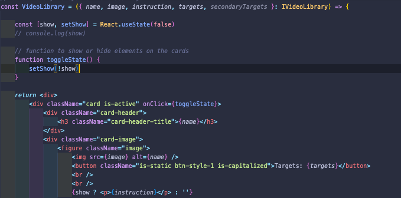
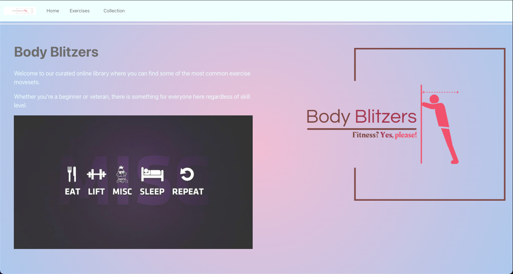
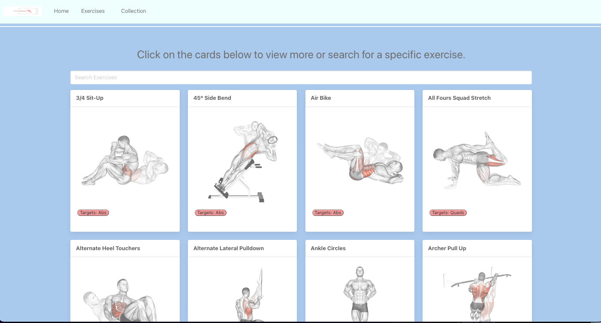
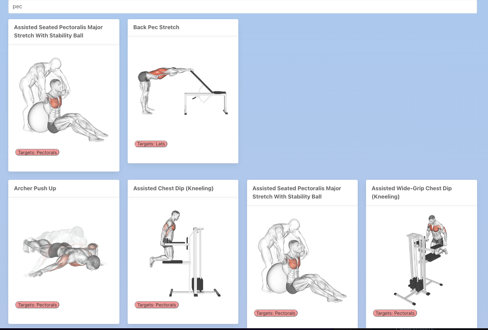
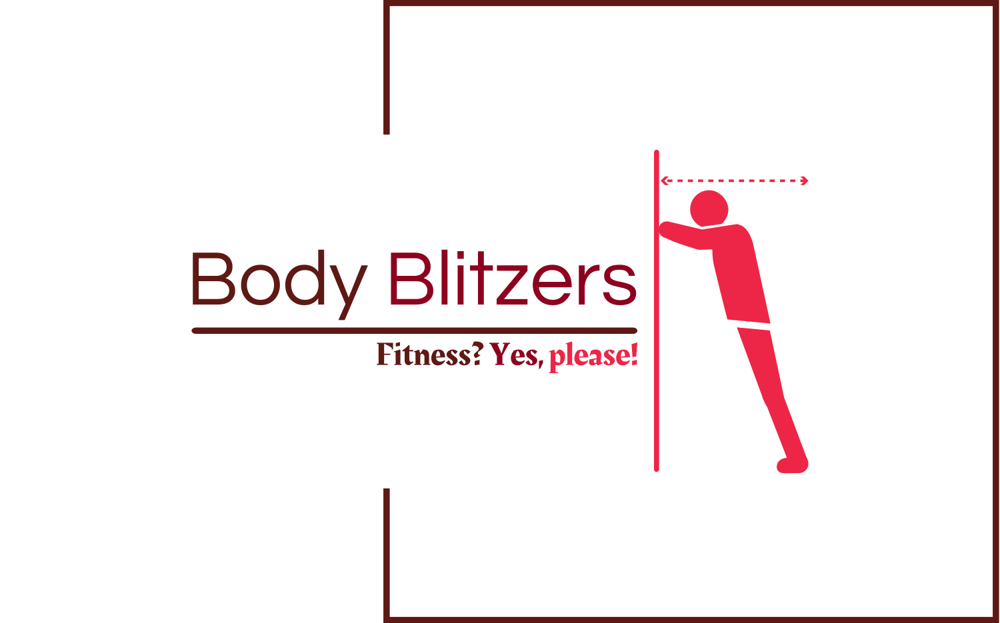

# General Assembly

Body Blitzers is an online fitness library API that houses a variety of exercises that includes images and instructions on how to perform them.

## Link to site

[Body Blitzers](https://bodyblitzers.netlify.app/)

## Overview

I was responsible for developing a React application that consumes a public API. The application needed to have a router and several pages connected. The entire duration of the project was 2 days and it was completed individually. Body Blitzers was created to be a video library of various exercises that you can view or search for a particular exercise.

## Languages Used:

### CSS with Bulma Framework

- Created video cards that can be used to display the exercise and additional information regarding it.
- Added a functionality to the cards that hides information and displays it when clicked on.
- Developed a persistent navigation bar that appears across all pages and shows the active one.

### React

- Used Router to create several route paths to connect the different components together.
- UseState to handle the fetch request to the API and manage the search function.
- UseEffect to limit fetch requests to the API only on page reload.
- Created props to pass relevant information from one component to the next.

## Project Progression:

Day 1 - Created a wireframe, pseudocode, and tested API with various endpoints to extrapolate the data. Added TypeScript interface to specify the type of data being used. Focused on the Exercise and Video Library components to extrapolate and display information received from the API. Home and Navbar pages were created as a landing page and a persistent navigation bar to display across all pages.

In the main App component the Router, Routes, and Routes were created to handle page navigation alongside with the Navbar component.

FilterLibrary and moreFilter functions handled the search feature to narrow down library results.

Used props to map and pass information pulled from the API to the other components.

Added useState to handle changes from using the search function and changes when making requests to the API. UseState was also used for displaying and hiding information on the cards when clicked.

UseEffect method aids to only fetch from the API one time when the page loads to prevent excess requests.

Day 2 - Created additional components Collection and Collection Album to display a visual library of the exercise moves. Utilised props to pass information pulled from the API to the page. Similar video cards were created to provide a consistent theme throughout the site.

Added through the use of React library a page scroll up arrow button. The button, when clicked, scrolls the page to the very top once the user has scrolled down on the page.

Utilised Bulma Framework to style the page and create 4 columns to keep the cards organised. Added more styling to the home page and created a custom logo for the site.

Added a visual ripple loading icon to the page when a fetch request to the API is made to display until the contents renders onscreen

### When the Home page loads:

- You are greeted with the site's logo, the title, a short description, and a slogan as the home page.

### When the Exercise page loads:

- The page is organised by 4 columns of exercise cards.
- The images are GIFs to give a more creative user experience.
- When a card is clicked on, it expands and displays the instructions on how to perform the move. Clicking the card again, hides this information.

### The search bar functionality:

- The filterLibrary and moreFilter functions created the search feature. Users are able to search for a specific exercise and it filters the cards based on inputted information.
- The function allows for the search criteria to be case insensitive and display the relevant cards.
- Users are able to search for moves based off of the exercise name that contains the typed characters or the body part that it targets.c\

- Created a custom logo for the site.

## Key learnings:

- Learned how to extrapolate specific information from APIs using specific endpoints.
- Learned how to incorporate APIs that require a key to implement them into the components without having to display a personal key.
- Learned about the various features that already come with React that can be used to perform certain functions or actions.

## Challenges:

- Determine which elements needed to put in useState and useEffect when making a fetch request to the API.
- Using a new CSS Framework to style the elements on the page.
- Using props to pass the relevant information through the components while managing which components were linked together.

## Future improvements:

- Add more components and pages for each target exercise group.
- Add page numbers at the bottom of the Exercises and Collection pages to minimise the amount of cards displayed at any given time.
- Incorporating the use of another API to show relevant videos on how to perform the exercise to provide a more user-friendly experience.

## Bugs:

- When pressing the backspace button to remove inputted search parameters, the pages slow down briefly. This is due to the amount of exercises being pulled from the API.
